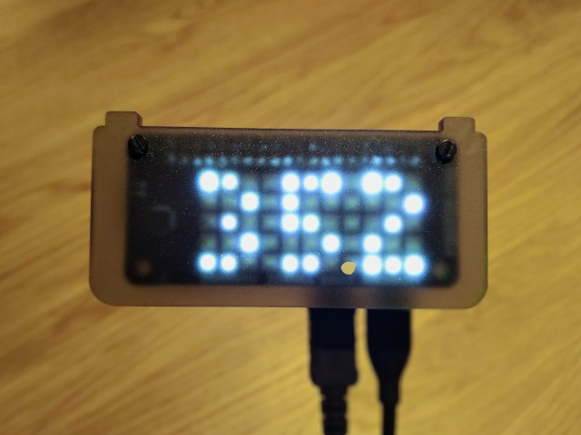

# Raspberry Pi / Scroll pHAT Harvest Weekly Time Tracked Display

See how many hours you've tracked this week in [Harvest](https://www.getharvest.com/) on an LED [Scroll pHAT](https://shop.pimoroni.com/?q=scrollphat) with a Raspberry Pi.

This can be deployed using [Balena Cloud](https://www.balena.io/cloud). Follow their [getting started guide](https://www.balena.io/docs/learn/getting-started/raspberrypi3/nodejs/) but `git push balena master` this project instead. 

You'll need to get a [personal access token](https://id.getharvest.com/developers) for your Harvest account.

The following envs are available to set:

- `HARVEST_ACCOUNT_ID=1234567`
- `HARVEST_PERSONAL_ACCESS_TOKEN=xxx`
- `BRIGHTNESS=200`

For the `BRIGHTNESS` value, use a number in the range 0-255

You'll see the amount of hours you've tracked on the display, in the format e.g. 25.5 hours (25 and a half hours). You might have noticed in the photo that I've cut out a tiny sticker to act as a `.` on the display.

